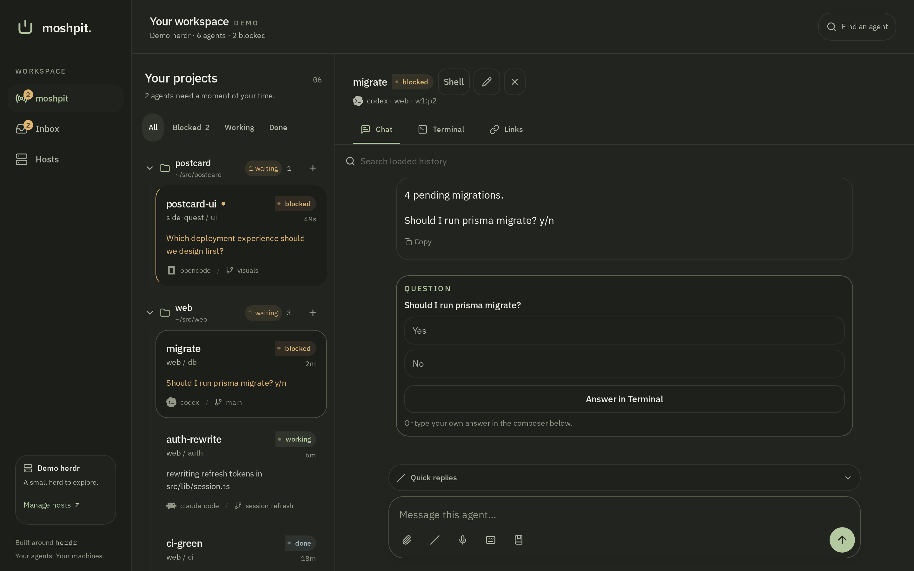
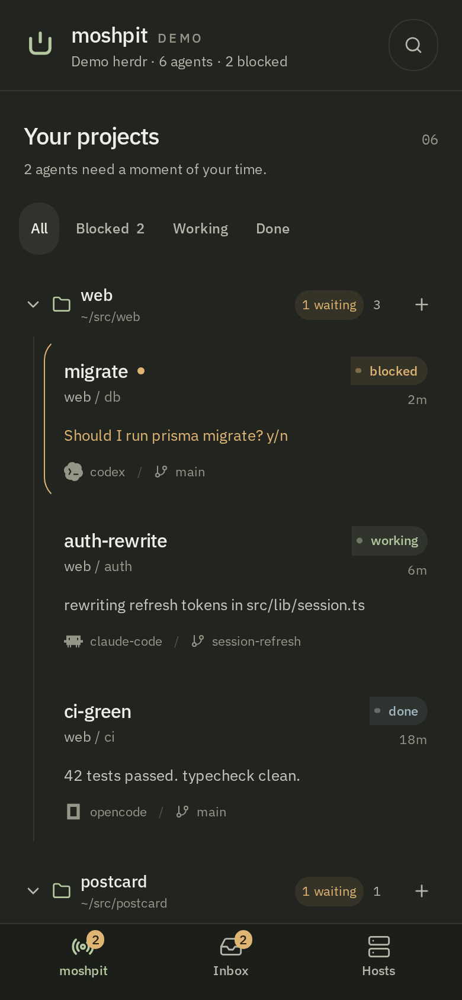
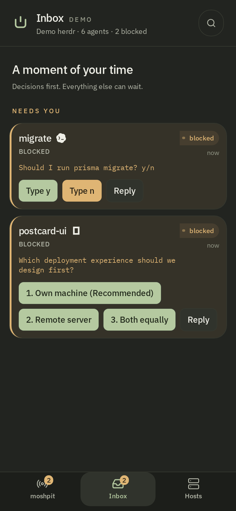
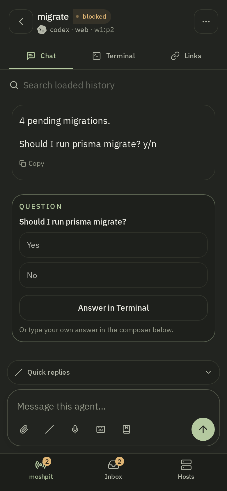
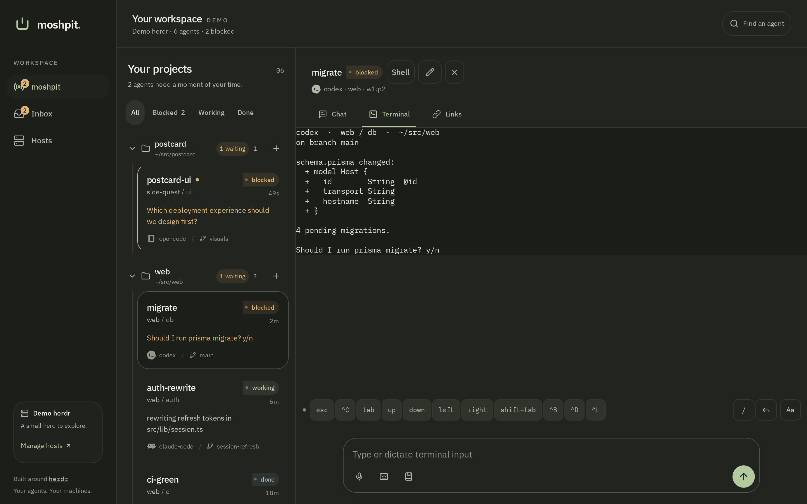

# moshpit

A little space for your whole herd.

Moshpit is a responsive PWA for the coding agents on your own machines. It connects to herdr through a Tailscale bridge, brings blocked agents to the top, and keeps conversation, exact output, and Terminal together.

The PWA is the release target for phones, tablets, laptops, and desktops. Native iOS is off the release calendar. The existing `ios/` project and Codemagic configuration remain as deferred work.



<p>
  
  
  
</p>

## Workspace

- **moshpit** shows your agents, with filters and a persistent conversation pane on larger screens.
- **Inbox** puts unresolved decisions ahead of completed activity; supported live choices can be answered from Chat or Inbox.
- **Hosts** manages browser bridge connections, appearance, notifications, and installation.

Phones use bottom navigation and a Back button inside each agent. Tablets use the available screen width. Laptops have a compact rail; desktops have a labeled sidebar. Chat has a readable text column, and Terminal uses the full detail pane.

Chat includes session history, image attachments, saved drafts, snippets, command suggestions, and collapsible quick replies. It can show the agent's live pane in place, for the menu or prompt a command opens. Native dialog support is deliberately narrow: recognized Codex choices use the pane's printed keys; unsupported dialogs fall back to Terminal. Blocked text replies insert without pressing Enter.

Terminal shows the pane's exact output, with a key bar for Esc, Ctrl combinations, Tab, and arrows, and an input line you can type or dictate into. A hardware keyboard also sends Home, End, Delete, Page Up and Down, function keys and modified arrows to the focused pane.



See [feature status and remaining work](docs/specs.md) for implementation boundaries and outstanding release checks.

The default light and dark palettes follow device appearance. All original herdr themes remain available. Green marks activity and actions; amber marks agents that need attention.

## Run locally

```sh
npm ci
npm run dev
```

Open `http://localhost:8080`. Use `http://localhost:8080/?demo=1` to explore the seeded demo without a machine. The screenshots above come from the demo; `node scripts/screenshots.mjs http://localhost:8080` regenerates them from a running server.

```sh
npm run build
npm run preview
```

The production build is `dist/spa`. Both development and production run the same client-rendered app.

## Use your own herd

Follow [PWA setup](docs/pwa.md) to run the bridge, connect your machine, and install the app.

The bridge binds to loopback and sits behind Tailscale Serve. It checks the Tailscale login and accepts writes only from browsers approved on the host with `node bridge/admin.mjs pair`. Agent prompts and terminal keys go to herdr on the host. The PWA does not open raw SSH or Mosh sockets.

The service worker precaches the app and its fonts, so the app reopens offline after one online visit. Agent operations require a connection. New versions download before the app offers a refresh.

## Verify

```sh
npm run typecheck
npm run verify:pwa
```

See [verification prerequisites and device checks](docs/pwa.md#verify-a-build). The browser check covers phone portrait and landscape, tablet, laptop, and desktop layouts in Chromium, Firefox, and WebKit.

## License

[MIT](LICENSE)
